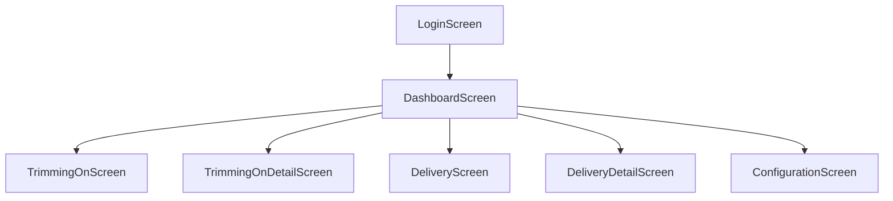

# KTB Production Tracking

A Flutter-based mobile application designed for internal production tracking at PT. Krama Yudha Ratu Motor. The system supports trimming-on and delivery features, user roles, and configurable settings.

## 🚀 Project Overview

**Name**: ktb_production_tracking  
**Platform**: Flutter (Android/iOS/Web/Desktop)  
**Purpose**: Manage and track production data (Trimming & Delivery)  
**Features**:
- Role-based dashboard (Admin, Trimming-On, Delivery)
- Summary and Transaction screens per role
- Settings configuration (Admin only)
- Secure logout and session handling

## 🛠 Tech Stack

- **Frontend**: Flutter + Dart
- **Backend**: REST API (e.g., ASP.NET Core)
- **Local Storage**: SharedPreferences / SQLite (if implemented)
- **Navigation**: Flutter Navigator
- **Assets**: PNG icons under `assets/icons`

### Build Environment
* Java JDK: 17

### Flutter & Dart
* Flutter: 3.19.6
* Dart: 3.3.3
* UI and business logic
* Platform support: Android, Web (internal usage only)

### State Management
* `flutter_riverpod` (v2.4.9) for scalability and testability

### Local Database
* `sqflite` (v2.3.2) for offline storage
* `path_provider` (v2.1.2) for DB file path

### HTTP & Network
* `http` (v0.13.6) package for API requests
* `connectivity_plus` (v4.0.2) to check online status

### Barcode Scanning
* `flutter_barcode_scanner` (v2.0.0) or `qr_code_scanner` (v1.0.1)

### Time Handling
* `intl` (v0.18.1) for formatting
* `DateTime.now()` for current time

### Secure Storage
* `shared_preferences` (v2.2.2) for storing token/session and user settings

## 🔗 API Integration

## 📁 Project Structure

```
lib/
├── core/                       # Core layer with reusable logic
│   ├── constants/                # API base URLs, endpoints, and fixed values
│   ├── errors/                   # Custom exceptions and error handling utilities
│   ├── models/                   # Data models (DTOs) used across the app
│   ├── services/                 # Network service classes for API interaction
│   └── utils/                    # Utility functions (e.g. date formatting, preferences)
├── features/                   # Feature modules, organized by domain
│   ├── auth/                     # Login screen and authentication logic
│   ├── dashboard/                # Main menu screen with role-based access logic
│   ├── delivery/                 # Delivery module (summary & transaction screens)
│   ├── settings/                 # Admin-only configuration settings
│   └── trimming_on/              # Trimming-On module (summary & transaction screens)
├── helpers/                    # SQLite and DB helper utilities
├── shared_widgets/             # Reusable UI components (e.g. Header, buttons)
├── app.dart                    # App configuration, theme setup, routing (if used)
└── main.dart                   # Application entry point and initial run logic
```

## 🔐 Role-Based Access

| Role         | Settings Icon | Trimming Summary | Trimming Transaction | Delivery Summary | Delivery Transaction |
|--------------|---------------|------------------|----------------------|------------------|----------------------|
| Admin        | ✅ Show       | ✅ Show         | ✅ Show              | ✅ Show         | ✅ Show              |
| Trimming-On  | ❌ Hide       | ✅ Show         | ✅ Show              | ❌ Hide         | ❌ Hide              |
| Delivery     | ❌ Hide       | ❌ Hide         | ❌ Hide              | ✅ Show         | ✅ Show              |

## 📱 Screens Overview

- `LoginScreen`: Authenticate user and route by role.
- `DashboardScreen`: Main menu with role-based cards and settings.
- `TrimmingOnScreen`: Summary of trimming-on data.
- `TrimmingOnDetailScreen`: Transaction update for trimming.
- `DeliveryScreen`: Summary of delivery records.
- `DeliveryDetailScreen`: Transaction update for delivery.
- `ConfigurationScreen`: Only visible to Admins.

## 🔄 Navigation Flow



## 📦 Assets

- `assets/icons/settings.png`
- `assets/icons/summary.png`
- `assets/icons/transaction.png`

## ▶️ Getting Started

```bash
flutter pub get
flutter run
```

## 📦 Building APK

```bash
flutter build apk --release
```

---

## 🔗 API Integration

This Flutter app integrates with a backend API following the OpenAPI 3.0 specification to manage production tracking.

### 📡 Base URL
```
/api/
```

### 🔒 Authentication

#### `POST /Auth/signin`  
Authenticates the user and returns a JWT token.

**Request Example:**
```json
{
  "username": "string",
  "password": "string",
  "shift": 1
}
```

**Response:**
- `200 OK`: Returns `AuthResultDto`
- `401 Unauthorized`: Returns `ProblemDetails`

### 🚚 Delivery Endpoints

#### `GET /Delivery/summary`  
Fetch summary of today's deliveries grouped by variant.

#### `GET /Delivery/transaction`  
Fetch detailed delivery transactions for today.

#### `PUT /Delivery/update-status?chassisNo=XYZ123`  
Update delivery status by chassis number.

**Responses:**
- `200 OK`: Success message + `DeliveryDto`
- `400 Bad Request` / `404 Not Found`: `ProblemDetails`

### ✂️ TrimmingOn Endpoints

#### `GET /TrimmingOn/summary`  
Fetch summary of trimming-on by cabin and color.

#### `GET /TrimmingOn/transaction`  
Fetch detailed trimming-on transactions for today.

#### `PUT /TrimmingOn/update-status?cabinNo=ABC123`  
Update trimming status by cabin number.

**Responses:**
- `200 OK`: Success message + `TrimmingOnDto`
- `400 Bad Request` / `404 Not Found`: `ProblemDetails`

### 📦 Data Models

#### AuthResultDto
```json
{
  "id": "string",
  "username": "string",
  "role": "string",
  "fullName": "string",
  "token": "string",
  "refreshToken": "string",
  "shift": 1
}
```

#### DeliveryDto
```json
{
  "id": "string",
  "chassisNo": "string",
  "color": "string",
  "quantity": 0,
  "shiftNo": 0,
  "variant": "string",
  "status": "string",
  "createdAt": "2024-01-01T00:00:00Z",
  "createdBy": "string",
  "updatedAt": "2024-01-01T00:00:00Z",
  "updatedBy": "string"
}
```

#### DeliverySummaryDto
```json
{
  "variant": "string",
  "quantity": 0
}
```

#### TrimmingOnDto
```json
{
  "id": "string",
  "cabinNo": "string",
  "color": "string",
  "productionDate": "2024-01-01T00:00:00Z",
  "shiftNo": 0,
  "line": 0,
  "current": "string",
  "processId": "string",
  "status": "string",
  "createdAt": "2024-01-01T00:00:00Z",
  "createdBy": "string",
  "updatedAt": "2024-01-01T00:00:00Z",
  "updatedBy": "string"
}
```

#### TrimmingOnSummaryDto
```json
{
  "cabin": "string",
  "color": "string",
  "quantity": 0
}
```

#### ProblemDetails
```json
{
  "type": "string",
  "title": "string",
  "status": 400,
  "detail": "string",
  "instance": "string"
}
```

### 🔐 Security

This API uses JWT Bearer token authentication.

**HTTP Header Example:**
```
Authorization: Bearer <token>
```